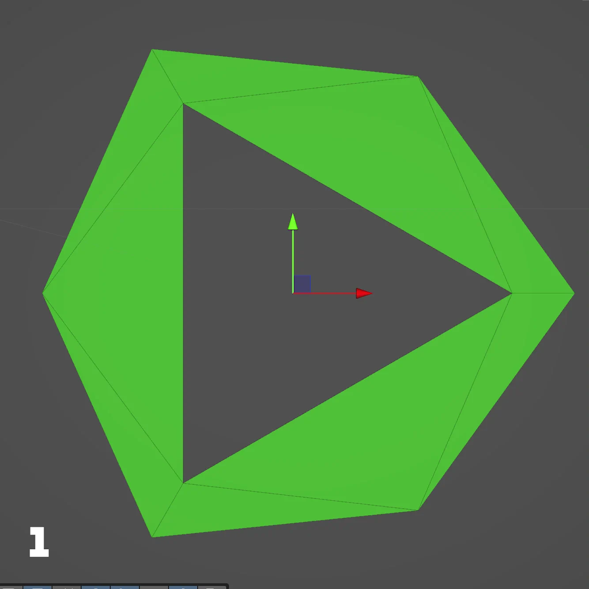

# urp-CircleRenderer

**Circle and ring** rendering for **URP** via the embedded package `jp.nobnak.circle`: patch meshes, tessellation, and GPU instancing.

This repo is a **Unity 6000.0+** project with that package embedded at `Packages/jp.nobnak.circle/`. Clone it, open the folder in Unity, then open a sample scene under `Assets/Scenes/` to try the shaders and instancing.

To use the renderer **in another project**, install **`jp.nobnak.circle`** from OpenUPM ([steps below](#installation-openupm)).

## Quick start

| Goal | What to do |
| ---- | ---------- |
| Explore samples in **this** repo | Open Unity **6000.0+** with URP, then **File → Open Scene** and pick `Assets/Scenes/Circle.unity`, `Ring.unity`, or `PointGrid.unity`. Only **PointGrid** is listed in **File → Build Settings** by default. |
| Add the package to **your** project | Add the OpenUPM scoped registry and install **`jp.nobnak.circle`** (see [Installation (OpenUPM)](#installation-openupm)). |

## Demo

### Package overview (video)

Instancing and tessellated circles/rings in Unity. Click the thumbnail to open YouTube.

### Tessellation along the arc (1 → 64)

Animated comparison of **ring** output while arc tessellation subdivision goes from **1** to **64** (how smoothness changes with patch density).

## Table of contents

- [Quick start](#quick-start)
- [Demo](#demo)
- [Overview](#overview)
- [Requirements](#requirements)
- [Installation (OpenUPM)](#installation-openupm)
- [What you get](#what-you-get)
- [Package layout](#package-layout)
- [Further documentation](#further-documentation)

## Overview

- **Tessellation** — Triangle patches (filled circle) and quad patches (ring); control tessellation along the arc.
- **Instancing** — Components that draw many instances with `Graphics.DrawMeshInstanced` and structured buffers.
- **URP** — Shaders appear under **jp.nobnak.circle** in the shader menu: **Circle** and **Ring**, each with **Opaque**, **Transparent**, **Instanced**, and **Instanced Transparent** variants.

Implementation details and design notes: [COMMENTS.md](COMMENTS.md).

## Requirements

- **Unity 6000.0 or later** — see the `unity` field in `Packages/jp.nobnak.circle/package.json`
- **Universal RP** — match the package dependency (e.g. `com.unity.render-pipelines.universal` **17.4.0**)
- **Shader Model 5.0** — target platform must support hull/domain tessellation

## Installation (OpenUPM)

The package is on [OpenUPM](https://openupm.com/). Use the same scoped-registry flow as [urp-TransparentRayTracer](https://github.com/nobnak/urp-TransparentRayTracer).

### 1. Add scoped registry

1. Open **Edit → Project Settings → Package Manager**.
2. Under **Scoped Registries**, click **+** and set:

   | Field    | Value                         |
   | -------- | ----------------------------- |
   | Name     | OpenUPM                       |
   | URL      | `https://package.openupm.com` |
   | Scope(s) | `jp.nobnak`                   |

3. Click **Save**.

### 2. Add the package

1. Open **Window → Package Manager**.
2. Set **Packages:** to **My Registries** (or any list that includes OpenUPM).
3. Select **Circle Renderer (URP)** (`jp.nobnak.circle`) and click **Install**.

Or use **Add package by name** and enter:

`jp.nobnak.circle`

**Package page:** [openupm.com/packages/jp.nobnak.circle](https://openupm.com/packages/jp.nobnak.circle)

## What you get

| Area | Summary |
| ---- | ------- |
| Shaders | Tessellated patch shaders: `jp.nobnak.circle/Circle/…` and `jp.nobnak.circle/Ring/…` (Opaque, Transparent, Instanced, Instanced Transparent) |
| Runtime | `CircleInstancedRenderer` / `RingInstancedRenderer`, `CircleInstance` / `RingInstance`, `CircleInstancedGroup` / `RingInstancedGroup`, and related data types |
| Meshes | `CirclePatchMesh` / `RingPatchMesh` and mesh assets from editor menus |
| Shared HLSL | `CircleShared.hlsl` (shared circle-side logic) |

Sample scenes (this repo): `Assets/Scenes/Circle.unity`, `Ring.unity`, `PointGrid.unity`.

## Package layout

Embedded package root:

`Packages/jp.nobnak.circle/`

Main folders:

- `Runtime/` — C# (renderers, instances, mesh builders)
- `Shaders/` — ShaderLab / HLSL
- `Editor/` — menu items to create mesh assets
- `Models/` — bundled mesh assets

## Further documentation

- **[COMMENTS.md](COMMENTS.md)** — Instancing behavior, patch layout and tessellation factors for circle/ring shaders, file map, and other maintainer notes.
